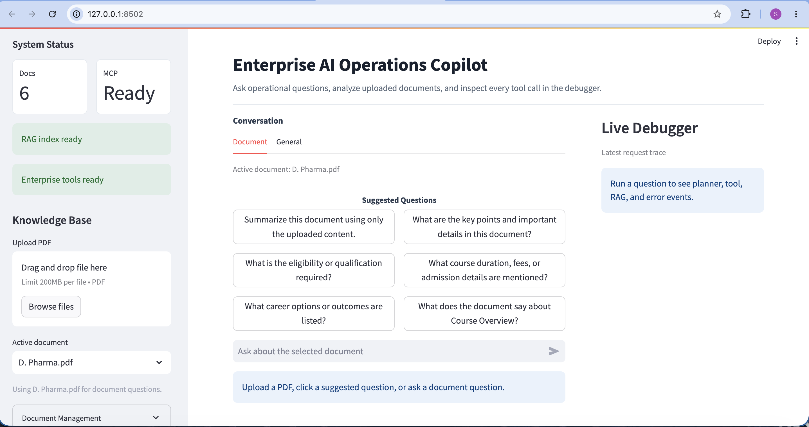
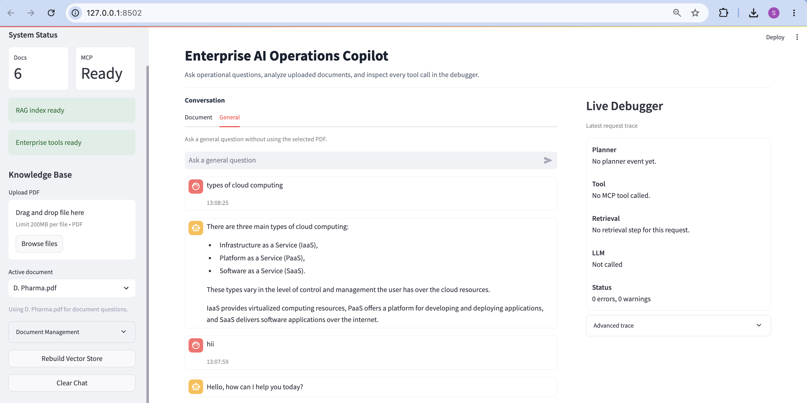

# Enterprise AI Operations Copilot

Local enterprise assistant built with Streamlit, FastAPI, LangGraph, SQLite,
FAISS RAG, in-process MCP-style tools, and Groq-backed LLM responses.

The app lets you upload PDFs, select the active document, ask document-grounded
questions, inspect retrieval/debug traces, and use simple enterprise tools for
employee profile, leave balance, date/time, and calculator queries.

For the full architecture and request lifecycle, see [WORKFLOW.md](WORKFLOW.md).

## Features

- Streamlit chat UI for PDF upload, active-document selection, document
  deletion, suggested questions, and chat history.
- FastAPI backend with health metadata, chat execution, tool listing, and debug
  traces.
- LangGraph workflow that routes each query through a planner, tool/RAG step,
  and response-memory step.
- In-process MCP-style gateway for employee info, leave balance, calculator,
  date/time, document listing, document deletion, index refresh, and document
  answering.
- PDF RAG pipeline backed by `sentence-transformers/all-MiniLM-L6-v2`, FAISS,
  local BM25 scoring, source filtering, confidence metadata, and page citations.
- SQLite-backed enterprise data and conversation/profile memory.
- Optional Groq LLM planner with deterministic keyword fallback.

## Screenshots

The frontend shows live backend readiness, RAG index status, active document
selection, evidence-aware suggested questions, chat input, and the latest
planner/tool/RAG debug summary.



General Conversation



## Project Structure

| Path | Purpose |
| --- | --- |
| `ui/streamlit_app.py` | Streamlit UI for uploads, active PDF selection, suggestions, chat, status, and debugging. |
| `app/main.py` | FastAPI app exposing health, tools, chat, and general-chat endpoints. |
| `app/agents/langgraph_agent.py` | Main LangGraph assistant workflow used by the API. |
| `app/agents/planner.py` | Keyword router plus optional Groq-backed planner. |
| `app/mcp/mcp_server.py` | In-process MCP-style tool registry and execution gateway. |
| `app/rag/ingest.py` | PDF loading, chunking, embedding, and FAISS index creation. |
| `app/rag/retriever.py` | Hybrid BM25 + FAISS document retrieval and grounded answer generation. |
| `app/rag/suggestions.py` | Evidence-aware suggested questions for selected PDFs. |
| `app/tools/` | Enterprise, calculator, and date/time tool implementations. |
| `app/database/`, `app/memory/` | SQLite initialization and conversation/profile memory helpers. |
| `data/documents/` | Uploaded PDFs. |
| `data/faiss_index/` | Generated FAISS index files. |

## Requirements

- Python 3.10 or newer
- A Groq API key for document and general LLM answers
- Local CPU is enough for the default MiniLM embedding model

Install dependencies:

```bash
python -m venv venv
source venv/bin/activate
pip install -r requirements.txt
```

Create a `.env` file or export environment variables:

```bash
GROQ_API_KEY=your_groq_api_key
```

Optional settings:

```bash
COPILOT_API_URL=http://127.0.0.1:8000
USE_LLM_PLANNER=false
PLANNER_MODEL=llama-3.3-70b-versatile
```

## Run Locally

Start the FastAPI backend:

```bash
uvicorn app.main:app --reload
```

In a second terminal, start the Streamlit UI:

```bash
streamlit run ui/streamlit_app.py
```

Open the Streamlit URL shown in the terminal, usually
`http://localhost:8501`.

## Typical Workflow

1. Upload one or more PDFs from the Streamlit sidebar.
2. Choose the active document from the sidebar selector.
3. Ask a document question directly or click a suggested question.
4. The UI sends the question and active `document_name` to `POST /chat`.
5. The backend routes the request through LangGraph and the MCP-style tool layer.
6. Document questions retrieve chunks from the selected PDF, generate a grounded
   Groq answer, and return confidence/source metadata.
7. The UI shows the answer, document label, timestamp, source/page pills, and a
   compact debug summary.

Example chat request:

```json
{
  "question": "Summarize this resume",
  "document_name": "SACHIN_CV0.pdf",
  "debug": true
}
```

## API

| Endpoint | Purpose |
| --- | --- |
| `GET /` | Basic app metadata. |
| `GET /health` | Backend readiness, RAG index status, document names, and MCP health. |
| `GET /tools` | Available MCP-style tools and required arguments. |
| `POST /chat` | Main assistant workflow for routed enterprise, document, and general queries. |
| `POST /general-chat` | Direct general LLM answer endpoint. |

Successful chat responses include the answer, selected action, optional document
metadata, and optional debug trace when `debug` is true.

## Data

SQLite files:

| Database | Path | Purpose |
| --- | --- | --- |
| Enterprise DB | `data/enterprise.db` | Employee and leave-balance sample data. |
| Memory DB | `data/memory.db` | Conversations and remembered employee IDs. |

The seeded enterprise employee is:

```text
EMP101 / Sachin / AI Team
Casual leave: 8
Sick leave: 5
```

Document index files:

```text
data/faiss_index/index.faiss
data/faiss_index/index.pkl
```

Uploading or deleting a PDF refreshes the local index from all PDFs currently in
`data/documents`. Document answers stay scoped by passing the selected
`document_name` through the UI, API, LangGraph state, and RAG retriever.

## Query Routing

The planner classifies queries as:

| Action | Example queries |
| --- | --- |
| `document` | "Summarize this resume", "What does the policy say about leave?" |
| `leave` | "What is my leave balance?", "Show sick leave for EMP101" |
| `employee` | "Who is EMP101?", "Show my employee profile" |
| `calculator` | "10 + 5", "20 * 3" |
| `date` | "What is today's date?", "What time is it?" |
| `general` | Any unclassified general question |

By default, routing uses deterministic keywords and regex checks. Set
`USE_LLM_PLANNER=true` to try Groq-based classification first; it falls back to
keyword routing if the key is missing, the call fails, or the response is
invalid.

## Notes

- `app/agents/agent.py` is an older linear agent; the FastAPI app uses
  `app/agents/langgraph_agent.py`.
- Document and general LLM answers require `GROQ_API_KEY`.
- The calculator intentionally supports simple two-number expressions.
- The MCP layer is in process, not a separate network MCP server.
